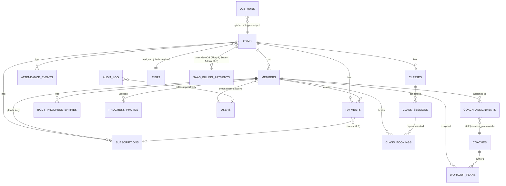

# Architecture Spine — gym_os

## Design Paradigm

Supabase-native: Postgres RLS is the *only* tenancy/authorization boundary — there is no app-side API gateway or repository layer re-implementing it. Three Next.js/Expo apps (dashboard, super-admin, mobile) talk to Postgres directly via `supabase-js`, through a thin per-domain service layer that performs no authorization logic of its own. The two points that genuinely need swappable external vendors (payments, messaging) are isolated behind Hexagonal ports (`PaymentProvider`, `OtpDeliveryProvider`, `WhatsAppMessageProvider`) — everywhere else, the pattern is deliberately *not* applied, since RLS already owns the one boundary that matters.

## Invariants & Rules

### AD-1 — RLS is the sole tenancy/authorization layer [ADOPTED]

- **Binds:** all
- **Prevents:** a second, driftable copy of tenancy/role logic in application code (repository pattern, app-side gateway)
- **Rule:** every table enables RLS with a deny-all default in the same migration as its `CREATE TABLE`. A `STABLE` helper (`private.gym_id()`) is reused across all tenancy checks. Explicit per-action (SELECT/INSERT/UPDATE/DELETE) policies per table, never `FOR ALL`.

### AD-2 — JWT custom-claims hook, canary-tested [ADOPTED]

- **Binds:** all auth
- **Prevents:** the hook's failure mode (silent deny-all) going undetected
- **Rule:** the claims hook is a `SECURITY DEFINER` Postgres function (`custom_access_token_hook`), never an HTTP Edge Function. A CI canary test asserts a known test tenant sees a non-zero, correctly-scoped row count on every run.

### AD-3 — Role/status authorization reads live state, not the JWT claim

- **Binds:** every RLS policy *and every `SECURITY DEFINER` function* that gates on role or gym status (existing and future) — not RLS policies alone; Epic 9 (FR-089/FR-090), Epic 11 (NFR-018, suspended-gym denial)
- **Prevents:** a demoted-but-not-logged-out staff member, or a member of a just-suspended gym, retaining stale access — the window "next token refresh" leaves open. Also prevents the specific regression AD-6 would otherwise inherit: `log_audit_event()` (`0007_audit_log.sql:191`) currently reads `auth.jwt() ->> 'app_role'` directly inside a `SECURITY DEFINER` body, exactly the pattern this AD retires — any new `SECURITY DEFINER` function (`create_staff_member()`, `update_staff_role()` per AD-6) must call the new helper, not copy that existing call site.
- **Rule:** a new `STABLE` helper, `private.current_member_role()`, performs a live lookup against `members` (scoped by `auth.uid()` + `private.gym_id()`); a second helper, `private.current_gym_status()`, does the same against `gyms.status`. Both are called on every RLS evaluation and from inside every `SECURITY DEFINER` function that currently branches on `auth.jwt() ->> 'app_role'` — including the pre-existing `log_audit_event()`, which this AD requires updating, not just new code. Role/deactivation/gym-suspension changes take effect on the very next query, no refresh required. `gym_id` itself stays claim-derived (the accepted multi-gym-membership resolution below is unaffected). A CI grep-lint gate forbids new `auth.jwt() ->> 'app_role'` call sites in `supabase/migrations/`, mirroring the existing i18n hardcoded-string lint gate's shape (fails the PR, not just a review-checklist item) — 27 existing migrations reference it today and are grandfathered, but no new one may.

### AD-4 — Multi-gym membership resolution (V1 limitation) [ADOPTED]

- **Binds:** the claims hook, any multi-gym-membership UI
- **Prevents:** undefined behavior when one user holds `members` rows at more than one gym
- **Rule:** the claims hook selects the single most-recently-created, non-deactivated `members` row for `gym_id`/session scoping. No gym-switcher exists.

### AD-5 — Super Admin escalation is explicit and audit-logged, never a blanket bypass [ADOPTED]

- **Binds:** Super Admin surfaces, FR-072
- **Prevents:** Super Admin's platform-wide role silently reading gym-scoped data outside the escalation flow
- **Rule:** cross-gym aggregates go through `SECURITY DEFINER`, aggregate-only functions (`platform_metrics()`, `gym_member_count()`) that self-enforce `private.is_super_admin()` internally — never a broadened row-level SELECT policy. Row-level access to a specific gym's data requires the audit-logged escalation action (FR-072).

### AD-6 — Staff creation/role-ceiling: one canonical RPC pair, plus a service-role account-creation step

- **Binds:** Epic 9 (FR-087, FR-089, NFR-013)
- **Prevents:** the "caller cannot create/edit an equal-or-above role" rule drifting between the creation and edit/self-edit call sites; a second, divergent staff-activation UX
- **Rule:** `create_staff_member()` / `update_staff_role()` are `SECURITY DEFINER` RPCs that internally check caller-role-vs-target-role against a hard allowlist via `private.current_member_role()` (AD-3) — never a copy of `log_audit_event()`'s stale `auth.jwt() ->> 'app_role'` read. Hierarchy: `Owner → Supervisor → Manager → Receptionist → Coach → Member` (new `member_role` enum value: `supervisor`). Owner creates Supervisor/Manager/Receptionist/Coach; Supervisor creates Manager/Receptionist/Coach only (never Supervisor/Owner); **Manager creates nothing** — the RPC's allowlist has no row granting Manager any target role. This RPC pair is *not* the same shape as Story 1.5's Super-Admin gym/owner creation (that one bypasses RLS entirely as Super Admin); it runs inside the caller's normal Owner/Supervisor RLS session, with the ceiling check in the function body. Only the second step reuses a prior shape: because Postgres functions cannot call the Supabase Auth Admin API, a passing ceiling check gates a Server Action that then calls `supabase.auth.admin.createUser` via the service-role admin client, mirroring Story 1.5/1.11's account-creation step specifically (not their authorization model). New staff activation reuses Story 1.11's existing temp-password-over-WhatsApp mechanism; no second activation flow.

### AD-7 — No repository pattern; thin per-domain service layer [ADOPTED]

- **Binds:** all three apps
- **Prevents:** an app-side copy of authorization rules that RLS already owns
- **Rule:** `services/<domain>.ts` per app wraps `supabase-js`, typed via `packages/types`. Not shared across apps (Next.js and Expo use `supabase-js` in different runtime contexts).

### AD-8 — No custom REST/GraphQL API surface [ADOPTED]

- **Binds:** all three apps
- **Prevents:** a second authorization boundary competing with RLS
- **Rule:** apps call Supabase directly via `supabase-js`/`@supabase/ssr`. Operations with business logic beyond CRUD go through Next.js Server Actions, never raw client-side inserts.

### AD-9 — Server Actions/service functions return `{ data, error }`, never throw for expected errors [ADOPTED]

- **Binds:** all three apps
- **Prevents:** silent divergence on "throw vs. return" across independently-written call sites
- **Rule:** only genuine bugs throw (caught by Sentry). Expected, user-facing errors return `{ data: null, error: { code, message } }`.

### AD-10 — Swappable external integrations sit behind a provider-interface port, isolated to their seam [ADOPTED]

- **Binds:** payments, OTP delivery, general messaging
- **Prevents:** vendor lock-in at the one or two points where a Cameroon-market vendor is genuinely likely to be swapped or fail
- **Rule:** `PaymentProvider`, `OtpDeliveryProvider`, `WhatsAppMessageProvider` own the call contract only; entity shapes stay the generated type from `packages/types` so an interface can't silently redeclare and drift from the schema. Applied *only* at these seams — not a general architectural style.

### AD-11 — OTP delivery is an ordered runtime fallback chain [ADOPTED, 2026-08-08]

- **Binds:** `send-sms-hook`, any future `OtpDeliveryProvider` implementation
- **Prevents:** a new call site re-introducing single-provider coupling; Evolution API's availability gating OTP delivery
- **Rule:** `EvolutionApiProvider → TwilioWhatsAppProvider → TwilioSmsProvider → SentDmProvider`, all implementing `OtpDeliveryProvider`. Chain advances only on failure (network error, non-2xx, or `DeliveryResult.success:false`); first success short-circuits; every attempt logged. `EvolutionApiProvider` requires its own passed sandbox spike (Story 2.9) before joining the production chain — a spike failure leaves the existing 3-provider chain as the production path.

### AD-12 — `WhatsAppMessageProvider`: a second, narrower interface for free-text sends [ADOPTED, 2026-08-08]

- **Binds:** member invitations (FR-082), any future non-OTP send
- **Prevents:** forcing free-text sends through `OtpDeliveryProvider`'s code+locale-shaped contract
- **Rule:** `send(phone, message, locale) → DeliveryResult`. V1.5 ships `EvolutionApiMessageProvider`, called from a Server Action (`sendMemberInvite`), following the established Deno→Node porting precedent (`sendTempPasswordMessage.ts`). Adds no new Edge Function. Backed by a new platform-wide `messaging_provider_config` table (mirrors `tiers`' shape: one row, Super-Admin SELECT/UPDATE RLS, `log_audit_event`-audited writes) storing the active Evolution API instance ID — `send-sms-hook` and `sendMemberInvite` both read it via their service-role clients; updatable without a redeploy when a connected number disconnects.

### AD-13 — Payment provider is DB-row + RPC-driven runtime switching, not an env var [ADOPTED]

- **Binds:** payments (Flow A)
- **Prevents:** requiring a redeploy to switch the active payment provider
- **Rule:** `payment_providers` table, exactly-one-active enforced via a partial unique index (`idx_payment_providers_one_active`); the only write path is `activate_payment_provider()` (`SECURITY DEFINER`) — no direct INSERT/UPDATE/DELETE RLS policy for any role. `active_payment_provider()` is the one narrow read every gym-scoped session gets.

### AD-14 — SaaS billing (Flow B) is a separate table and RLS audience from member payments (Flow A)

- **Binds:** Epic 11 (FR-124–138); Epic 4's reconciliation job (FR-036/FR-137)
- **Prevents:** every existing Flow-A-only RLS policy and reconciliation query from needing a `flow`/nullable-`gym_id` branch it doesn't otherwise need, for two flows whose audiences are already fully disjoint; Epic 4's and Epic 11's independently-scheduled reconciliation jobs (AD-19: each cron job is its own independent transaction) silently disagreeing on what "discrepancy" means since they now touch different tables
- **Rule:** a new `saas_billing_payments` table, Super-Admin-scoped RLS, distinct from gym-scoped `payments`. `PaymentProvider` gains a discriminated routing context — `{type:'gym', gym_id}` selects a gym's Vault-stored Tara Money credentials, `{type:'platform'}` selects GymOS's own — at initiation, verification, and reconciliation. Mirrors the existing `job_runs`/`audit_log` precedent of platform-level concerns getting their own table rather than a nullable `gym_id` bolted onto a gym-scoped one. The single shared `payment-webhook` Edge Function dispatches on the routing context carried in the webhook's own reference/metadata (not a second Edge Function) to decide which table a given event resolves against; `payment_webhook_events` stays one shared log table (events are the DB-idempotency boundary regardless of flow) rather than splitting per-table. Both jobs' discrepancy detection (the 4-category classification from FR-036/FR-137, including the wrong-account-settlement category) is implemented as one shared function/module called by both cron jobs — the separate-table decision must not become a separate, silently-drifting discrepancy-semantics decision.

### AD-15 — Per-gym payment credentials are Vault-encrypted [ADOPTED, 2026-08-11]

- **Binds:** Epic 11's "connect payment account" flow (FR-126)
- **Prevents:** a second, app-layer encryption scheme when Supabase already ships one
- **Rule:** per-gym Tara Money credentials are stored in Supabase Vault — chosen over pgsodium/app-layer encryption as the least code to own and maintain.

### AD-16 — Money is integer + currency column, never a float [ADOPTED]

- **Binds:** all payment/subscription tables
- **Prevents:** floating-point rounding error in financial data
- **Rule:** XAF (and any future currency) stored as integer minor units with an explicit currency column.

### AD-17 — Webhook processing is idempotent [ADOPTED]

- **Binds:** `payment-webhook`
- **Prevents:** a duplicate webhook delivery double-processing a payment
- **Rule:** every webhook event is logged to `payment_webhook_events` before being acted on; signature verification (NFR-002) happens before any DB write.

### AD-18 — Subscription lifecycle is a four-state machine driven by a scheduled job [ADOPTED]

- **Binds:** subscriptions
- **Prevents:** ad hoc, scattered expiry logic across call sites
- **Rule:** `active → expiring_soon → grace_period → expired`, transitions owned by one `pg_cron` job. Grace period is gym-configurable (platform default 3 days). No proration on mid-cycle tier change (OQ-15) — the new price applies at the next billing cycle.

### AD-19 — Independent scheduled jobs, one table for job observability [ADOPTED]

- **Binds:** all `pg_cron` jobs
- **Prevents:** one job's failure silently blocking or corrupting another; a job queue's added complexity with no retry-with-backoff requirement to justify it
- **Rule:** each cron trigger is its own function/transaction, each logs to `job_runs` (job_name, started_at, finished_at, status, error). No shared trigger; no external job queue (BullMQ/graphile-worker) for this project's scale.

### AD-20 — Realtime has an explicit degrade path [ADOPTED]

- **Binds:** the front-desk alert panel and any future live dashboard surface
- **Prevents:** a retention-critical alert failing silently while the gym believes the safety net still exists
- **Rule:** dashboard falls back to short-interval polling if the Supabase Realtime channel drops.

### AD-21 — Bounded-capacity actions are a row-locked check-then-insert RPC, not a bare insert or a uniqueness index

- **Binds:** Epic 12 class booking (FR-105), class attendance (FR-107)
- **Prevents:** overbooking under concurrent requests; a second, disconnected source of truth for "did this member attend" once class attendance exists alongside floor check-in
- **Rule:** `book_class_session()` is a `SECURITY DEFINER` RPC that `SELECT ... FOR UPDATE`-locks the `class_sessions` row, counts existing bookings, and inserts only if under capacity — one atomic transaction, self-checking caller role/tenant like `check_in()`/`confirm_renewal()` already do. Distinct from the one-open-check-in invariant (AD-22): that is a 0-or-1 uniqueness constraint; this is a bounded count, which a partial unique index cannot express. Class attendance (a Receptionist marking a booked member present, FR-107) is a status column on `class_bookings`, never a write to `attendance_events`/`check_in()` — FR-107 explicitly treats class attendance as distinct from floor check-in while reusing the same member-status rules (expired members can't be marked attended, and it triggers the same front-desk alert, FR-049); `attendance_events` remains floor-check-in-only. **Flagged as extrapolation from precedent, not a proposal-sourced decision** — confirm the RPC-vs-lighter-mechanism call during Epic 12 story-writing.

### AD-22 — One-open-check-in-per-member is a partial unique index [ADOPTED]

- **Binds:** attendance
- **Prevents:** a member holding two simultaneous open check-ins
- **Rule:** `idx_attendance_events_one_open_per_member`, a partial unique index — the DB-level enforcement of record, not an app-side pre-check alone.

### AD-23 — Offline support is scoped per-domain, each its own idempotent queue-item type — not a generic action queue [ADOPTED, extended]

- **Binds:** mobile check-in (V1.0), workout-completion logging (V1.5, FR-110)
- **Prevents:** queuing a generic action whose conflict-resolution rule is undefined (the V1.0 rationale this AD preserves — payments, class bookings, or any other stateful/capacity-checked action still do **not** get offline queueing)
- **Rule:** each offline-capable action is its own explicit, `client_id`-keyed queue-item type with its own conflict-resolution rule (check-in: timeout backfill; workout completion: idempotent upsert, no backfill concept needed). Class booking (AD-21) is explicitly excluded — its synchronous, row-locked capacity check has no offline-queueable equivalent; a queued booking could not honor `book_class_session()`'s atomicity guarantee. The mobile app's existing SQLite offline-queue infrastructure is reused, not duplicated, for the second item type. **Flagged as extrapolation from precedent, not a proposal-sourced decision** — confirm during Epic 13 story-writing.

### AD-24 — Progress photos live in a dedicated private bucket, never the public one [ADOPTED]

- **Binds:** Epic 10 (NFR-011)
- **Prevents:** copy-pasting the existing `member-photos` bucket's `public = true` setting onto a domain that needs per-photo, revocable consent
- **Rule:** a new Storage bucket, private, signed URLs, non-guessable paths. Per-photo coach-sharing consent (FR-095): default-off, immediate-revoke, non-retroactive viewing history — revocation invalidates any already-issued signed URL for that photo (short TTL, re-verified per photo), not just future issuance.

### AD-25 — Push notification dispatch is DB-triggered, not a service-layer responsibility [ADOPTED]

- **Binds:** all push notifications (N-01 through N-05 shipped; N-06/N-07 quiet-gym-alert and class-reminder extensions land under this same mechanism, Epic 6)
- **Prevents:** notification-sending logic scattering into individual Server Actions/service functions, each a separate place to get delivery/retry/token-cleanup wrong
- **Rule:** the `pg_net` Postgres extension calls Expo's Push API directly from a `send_push_notification()` Postgres function, invoked by cron jobs (subscription-lifecycle) and `AFTER INSERT/UPDATE` triggers (payments). Stale push-token cleanup happens in the same function on delivery failure. No new Edge Function — keeps AD's Edge-Function-count-is-a-design-property intact (Structural Seed).

### AD-26 — Member-cap enforcement is a DB trigger backstop, with a fast-fail duplicate check in the Server Action [ADOPTED]

- **Binds:** member creation and invitation (FR-086, Epic 9's staff creation is exempt — staff don't count against a gym's member cap)
- **Prevents:** any client-side-only cap check being bypassable; a slow, unfriendly failure at the DB layer for the common case
- **Rule:** a `BEFORE INSERT` trigger on `members` comparing active+deactivated count against the gym's tier cap (`tiers.member_cap`, nullable = unlimited; `gyms.member_cap_override`, nullable = use tier's own cap) is the enforcement of record — cannot be bypassed by any client. `createMember`'s Server Action performs the same check first for a fast, friendly failure before ever reaching the trigger; the trigger is the backstop, not the only line of defense.

## Consistency Conventions

| Concern | Convention |
| --- | --- |
| Naming (DB) | snake_case, plural tables (`members`, `payments`); FKs as `<singular>_id`; indexes as `idx_<table>_<column(s)>` |
| Naming (RPCs / Server Actions) | RPCs snake_case verb_noun (`renew_subscription()`); Server Actions camelCase verbNoun (`createMember`) |
| Naming (code) | Components PascalCase (file name matches); hooks `useX.ts`; shared types PascalCase, defined once in `packages/types` |
| Data shape boundary | `snake_case` for anything that is a DB row shape (matches `supabase gen types` directly); `camelCase` only for pure UI-local state/props that never round-trip to the DB |
| Dates | UTC `timestamptz` in DB and over the wire always; locale formatting only at UI render |
| Booleans | native Postgres `boolean`, never `0`/`1` |
| Soft delete | `deactivated_at` timestamp, never a boolean flag |
| Error shape | `{ code: string, message: string }` — `code` feeds one centralized error-mapping utility; `message` is already-localized EN/FR. Components never hand-write error copy |
| Validation | Zod schemas live once in `packages/types`, consumed by every write boundary (forms, Server Actions, Edge Functions) — never redefined inline |
| Realtime channels | `gym:<gym_id>:alerts` — scoped per gym in the channel name itself |
| Query cache keys | array convention `[domain, filters]`, e.g. `['members', { status: 'expired' }]` |
| Structure | tests co-located (`*.test.ts(x)`); pgTAP in `supabase/tests/`, one file per sensitive table; components organized by feature/domain, not generic type |
| Test OTP guardrail | `SMS_TEST_OTP` (phone→fixed-code map) lives in `supabase/config.toml` for local dev + staging **only**, a small explicitly-reserved test-number set, never a wildcard. Promoting config to production must explicitly drop it — a leaked test OTP in production lets anyone authenticate as any phone number. Required deployment-checklist step, not just a convention. |

## Stack

| Name | Version |
| --- | --- |
| Next.js (dashboard, super-admin) | 16.3.0 (repo pins `"latest"`; re-verify before any hard pin) |
| Expo SDK (mobile) | 57.0.7 (React Native 0.86, React 19.2) |
| Turborepo + pnpm workspaces | 2.x (Turborepo 2.10.x) |
| Supabase (Postgres, Auth, Realtime, Storage, Edge Functions) | Cloud, EU West (`eu-west-1`) |
| Supabase Vault | per-gym credential storage (AD-15) — confirm current GA/beta status before treating as a hard payments dependency (Supabase docs carried beta language as of this spine; pgsodium is pending deprecation in its favor) |
| TanStack Query | client-side cache, dashboards |
| shadcn/ui + Tailwind | dashboards only (Expo app styles independently) |
| Sentry | sole V1/V1.5 observability tool |
| Zod | `packages/types`, single validation source |

## Structural Seed

```text
gymos/
  apps/
    dashboard/       # Gym Admin Dashboard (Next.js, App Router)
    super-admin/      # Super Admin Dashboard (Next.js, separate Vercel deployment)
    mobile/           # Member App (Expo Router)
  packages/
    types/            # ONLY shared package: generated DB types, Zod schemas, error mapping, shared admin locales
  supabase/
    migrations/       # 50+ to date, RLS-enabled in the same migration as CREATE TABLE
    functions/        # 3 Edge Functions: payment-webhook, send-sms-hook, gym-qr-display
    tests/            # pgTAP, one file per sensitive table + cross-cutting isolation/canary tests
  docs/
    decisions.md      # sandbox spikes, deviations, pattern amendments — the implementation-level decision log this spine's ADs summarize
```

**Deployment & environments:** Vercel (dashboard, super-admin — two separate projects, same monorepo, different root dirs), Supabase Cloud (EU West, `eu-west-1` — confirmed via measured RTT, a statistical tie with Frankfurt, retained to avoid churn on an empty-vs-populated project), EAS Build+Submit for mobile. GitHub Actions CI: typecheck, pgTAP against a Supabase preview branch (Supabase Branching, not a hand-provisioned staging project), i18n hardcoded-string lint gate. No production traffic yet — pilot/staging is the current ceiling.

**Edge Functions (exactly 3, each isolated to one external-facing concern):** `payment-webhook` (provider-generic signature verification + idempotent write — Tara Money is the current active provider via `payment_providers`, not a hardcoded name; dispatches Flow A/Flow B per AD-14), `send-sms-hook` (the `OtpDeliveryProvider` fallback chain, AD-11), `gym-qr-display` (Story 8.2, e-ink display endpoint, `gym_token` bearer secret). Adding a 4th requires a deliberate AD, not an ad hoc addition — the count is a design property (attack surface, runtime boundary), not an incidental fact.

**Named infra risk:** Evolution API (AD-11, AD-12) runs self-hosted, outside Supabase Cloud's or Vercel's managed SLA — the first platform dependency with that property. The OTP fallback chain (AD-11) is the explicit mitigation for OTP; `WhatsAppMessageProvider` (AD-12) has no equivalent fallback for invite sends, since it has exactly one implementation — an invite send failure surfaces to the Owner/Manager as a manual-send fallback in the dashboard UI (the pre-existing `InviteMemberModal`), not a silent drop. Story 2.9's sandbox spike should confirm recovery from an outright connector ban (unofficial WhatsApp gateways face automated ban detection, not just downtime), not only an availability outage.



## Deferred

- Shared `packages/ui` component library — until duplication between dashboards actually hurts.
- NativeWind / Tailwind-for-React-Native — current UX spec doesn't need it.
- Redis or any external cache layer — no scale justification at pilot size.
- A real job queue (BullMQ/graphile-worker) — until three independent `pg_cron` triggers stop being sufficient.
- PostHog analytics (NFR-014) — unhomed; fold into whichever of Epics 9–13 ships first as 1–2 stories, not its own epic.
- E2E test baseline (NFR-015) — this project's first E2E investment (current CI is pgTAP + typecheck + i18n parity only); mechanism (Playwright vs. other) not yet chosen.
- **OQ-14 (Flow B billing-job shape) is resolved in the finalized PRD v1.5**, not left open as the 2026-08-11 correct-course proposal's Section 4.1 originally framed it mid-session: Tara Money cannot auto-debit, so V1.5 ships reminder-to-approve billing (`prd.md` FR-130/FR-133, OQ-14). AD-14's data model (separate `saas_billing_payments` table, Owner-initiated via a payment link, not a collection job) was already shaped for exactly this — no architecture change follows from this resolution, it confirms AD-14 rather than blocking it.
- **OQ-7 is resolved** — the sandbox spike re-verification against GymOS's real activated business account (`9FmIZg9GBB`), swapping off the Temporal stand-in, passed in full (`docs/decisions.md`, 2026-08-13, Story 4.10; `prd.md` Open Questions table updated to match, 2026-08-17). This was an account-credential swap, not a data-model question; it didn't block any AD above, since AD-14/AD-15's credential-selection mechanism is account-agnostic. Full production reliance on Tara Money still awaits Story 4.12's cutover (backlog), tracked separately from OQ-7.
- OQ-12/13 (per `prd.md`'s Open Questions table) — carried forward from the PRD, not architecture-blocking.
- Free/test tier for beta-gym SaaS-billing exemption (FR-139) — a billing/product rule, not a structural decision; no new AD needed unless it turns out to require a new table shape beyond `saas_billing_payments`.
- Class/workout entity detail (columns, exact cardinalities beyond the ERD above) — left to Epic 12/13 story-writing; the ERD fixes only what another epic could build incompatibly against (that these are gym-scoped, that bookings are capacity-checked, that plans belong to one member).
